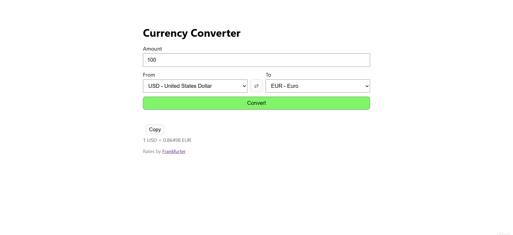
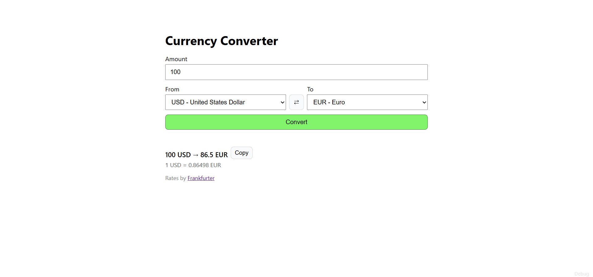
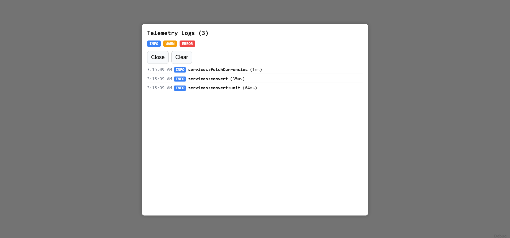
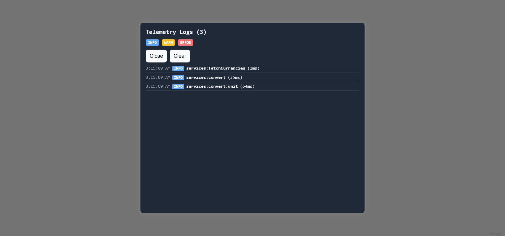
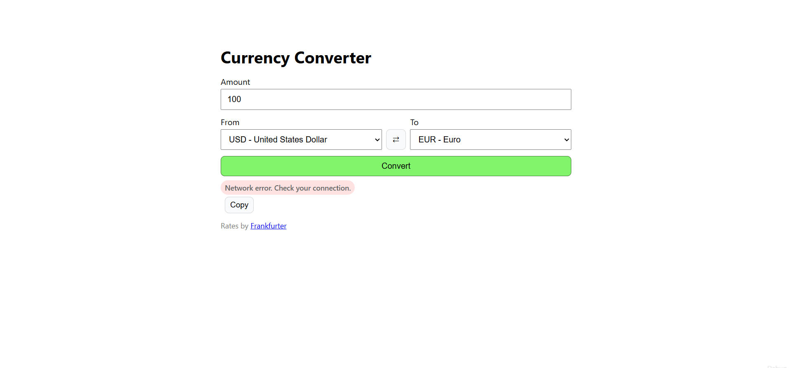
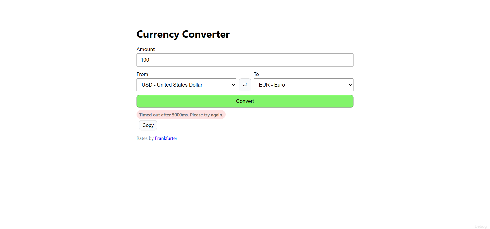

# TypeScript Currency Converter

A lightweight, fully typed currency converter built with **TypeScript, Vite, and DOM APIs**.
It fetches live exchange rates from the **Frankfurter API**, includes runtime validation, timeout + retry handling, local caching, telemetry logging, and a browser-based debug overlay.

[](https://conorgregson.github.io/ts-currency-converter)


---

## Tech Stack Overview

### Core


### APIs & Tools


---

## Live Demo

**▶ Try it now:** https://typescript-currency-converter.vercel.app

> Data is cached locally in your browser via `localStorage`.

---

## About

This mini-app focuses on **strong types and clean architecture** without a framework. It demonstrates how to:

- model and validate API data with runtime guards
- isolate fetch logic with **timeout + retry**
- cache currency metadata with a **TTL-based localStorage layer**
- track runtime events with a small **telemetry logger**
- provide accessible status updates and keyboard shortcuts in a minimal UI

---

## Features

- **Live currency conversion** using the Frankfurter API
- **Runtime validation** for API response shapes
- **Timeout + retry** handling for resilient network requests
- **TTL cache** for the currencies list
- **Telemetry logging** with a browser debug panel
- **Accessible UI feedback** with `aria-live` status updates
- **Keyboard shortcuts**
  - `Ctrl/⌘ + K` → focus amount input
  - `Shift + S` → swap currencies
- **Browser-based test harness** using mocked fetch responses

---

## Tech Stack

- **TypeScript** — strict typing across domain, service, UI, and utility layers
- **Vite** — dev server and production build pipeline
- **HTML5** and **CSS3** — semantic markup and lightweight styling
- **Fetch API** — network access for exchange rate requests
- **Frankfurter API** — live currency data
- **LocalStorage API** — caching and telemetry persistence
- **ES Modules** — modular browser-native architecture

---

## Project Structure

```bash
ts-currency-converter/
│
├── src/
│   ├── app.ts
│   ├── main.ts
│   ├── config.ts
│   ├── vite-env.d.ts
│   │
│   ├── domain/
│   │   └── currency.ts
│   │
│   ├── services/
│   │   └── frankfurter.ts
│   │
│   ├── ui/
│   │   ├── render.ts
│   │   ├── debug-panel.ts
│   │   └── modal.css
│   │
│   └── utils/
│       ├── cache.ts
│       ├── dom.ts
│       ├── errors.ts
│       ├── http.ts
│       ├── logger.ts
│       └── result.ts
│
├── tests/
│   ├── index.ts
│   ├── mocks.ts
│   └── index.html
│
├── dist/                  # Vite production output
├── index.html             # App shell
├── styles.css             # Global styles
├── package.json
├── tsconfig.json
├── tsconfig.tests.json
├── README.md
└── LICENSE
```

---

## Screenshots

### Main UI

The main interface showing amount input, currency selectors, and conversion output.



### Conversion Result

A completed conversion showing the converted value and copy button.



### Debug Panel (Light)

Telemetry overlay in light mode with structured logs and color-coded levels.



### Debug Panel (Dark)

Telemetry overlay in dark mode for contrast testing.



### Network Error (Offline / Broken Endpoint)

In-app error message displayed when network requests fail due to offline mode or invalid API endpoint.



### Timeout Error

App gracefully handling a delayed response, showing timeout feedback after 5000 ms.



---

## Getting Started

### 1. Clone the project

```bash
git clone https://github.com/conorgregson/ts-currency-converter.git
cd ts-currency-converter
```

### 2. Install Dependencies

```bash
npm install
```

### 3. Start the Vite dev server

```bash
npm run dev
```

### 4. Build for production

```bash
npm run build
```

### 5. Preview the production build

```bash
npm run preview
```

---

## Running Browser Tests

This project keeps a small browser-based test harness alongside the main Vite app.

### Build the test files

```bash
npm run build:tests
```

### Run the tests

Open:

```text
tests/index.html
```

The tests cover core utility and service behavior using a mocked `fetch` queue.

---

## Available Scripts

```bash
npm run dev
npm run build
npm run preview
npm run build:tests
npm run test:browser
```

---

## Architecture Notes

The project is organized into small focused layers:

- `domain/` → branded types and runtime validators
- `services/` → typed API client logic
- `ui/` → DOM rendering and debug panel helpers
- `utils/` → result handling, caching, HTTP helpers, logging, and DOM helpers

This keeps the app logic easy to trace and makes each file easier to test and maintain.

---

## Learning Focus

This project was built to practice:

- modular frontend architecture without React or other frameworks
- strong TypeScript typing and runtime validation
- resilient HTTP handling with timeout and retry behavior
- caching and observability patterns
- progressive enhancement for accessibility and debugging

---

## Known Limitations & Future Improvements

- add historical conversion support
- display richer rate metadata
- persist last-used amount and currencies
- improve copy-result feedback
- consider migrating browser tests to a more formal test runner later

---

## Author

Made by Conor Gregson

- [GitHub](https://github.com/conorgregson)
- [LinkedIn](https://www.linkedin.com/in/conorgregson)

---

## License

This project is open-source and available under the **MIT License**. See the [LICENSE](/LICENSE) file for details.
