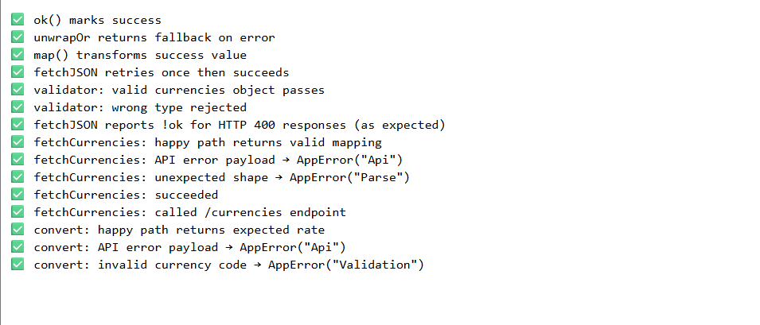

# TypeScript Currency Converter

A lightweight, fully typed currency converter built with **plain TypeScript + DOM APIs**.
Fetches live exchange rates from the [Frankfurter API](https://www.frankfurter.app/), supports caching, telemetry logging, and a developer debug overlay — all dependency-free.

[](https://conorgregson.github.io/ts-quiz-app)


---

## Tech Stack Overview

### Core


### APIs & Tools


---

## Live Demo

**▶ Try it now:** https://conorgregson.github.io/ts-currency-converter

> Data is saved locally in your browser via `localStorage`

---

## About

This mini-app focuses on **strong types and clean architecture** without frameworks. It shows how to:

- Model and validate API data with runtime guards.
- Isolate fetch logic with **timeout + retry** and **TTL cache**.
- Track performance via a tiny **telemetry logger** and **debug overlay**.
- Keep the UI accessible with `aria-live` updates and keyboard shortcuts.

---

## Features

- **Live currency conversion** using the Frankfurter API
- **Runtime validation** for all API responses
- **Configurable caching** with TTL (localStorage)
- **Timeout & retry** logic for resilient requests
- **Telemetry logging** for performance timing
- **Debug overlay** (⌘/Ctrl + D or “Debug” link) showing color-coded logs
- **Accessible UI** with `aria-live` updates and keyboard shortcuts
  - `Ctrl/⌘ + K` → focus amount
  - `Shift + S` → swap currencies

---

## Tech Stack

- **TypeScript** (strict mode enabled) — all modules fully typed with `noImplicitAny`, `strictNullChecks`, and runtime validation for API data.
- **HTML5** and **CSS3** — semantic structure and responsive styling for a minimal, accessible interface.
- **Fetch API** + **Frankfurter API** — retrieves live exchange rates with proper error handling and retry logic.
- **LocalStorage API** — caches currency lists and recent conversions with TTL-based persistence.
- **ES Modules** — uses browser-native imports for modular, dependency-free architecture.
- **Compiled** via `tsc -w` — automatic TypeScript-to-JavaScript compilation into `/build/js`.

---

## Project Structure

```bash
ts-currency-converter/
│
├── src/
│   ├── app.ts                            # orchestrates events & state
│   ├── main.ts                           # entry point
│   ├── config.ts                         # constants (API base, TTL, flags)
│   │
│   ├── domain/
│   │   └── currency.ts                    # runtime validation + branded types
│   │
│   ├── services/
│   │   └── frankfurter.ts                 # typed API client
│   │
│   ├── ui/
│   │   ├── render.ts                      # DOM helpers & status/result rendering
│   │   ├── debug-panel.ts                 # developer overlay for telemetry logs
│   │   └── modal.css                      # styling for debug overlay (light/dark)
│   │
│   ├── utils/
│   │   ├── cache.ts                       # TTL-based caching (localStorage)
│   │   ├── errors.ts                      # AppError definitions
│   │   ├── http.ts                        # fetchJSON with timeout & retry
│   │   ├── logger.ts                      # telemetry logger + helpers
│   │   └── result.ts                      # functional Result<T,E> pattern
│   │
│   └── tests/
│       ├── index.ts                       # browser-based integration tests
│       ├── mocks.ts                       # step-based fetch mocking
│       └── index.html                     # test runner
│
├── build/                                 # Compiled JavaScript output (tsc)
│   └── js/
│       └── *.js
│
├── dist/                                  # production-ready minified JS (via esbuild)
│   └── js/
├── images/                                # Screenshots
│   ├── main-ui.png
│   ├── debug-panel-light.png
│   ├── debug-panel-dark.png
│   ├── error-state.png
│   └── tests-pass.png
│
├── index.html                             # Main HTML file
├── styles.css                             # Base styling
│
├── esbuild.minify.mjs                     # minifier script for dist build:contentReference[oaicite:3]{index=3}
├── tsconfig.json                          # TypeScript configuration
├── tsconfig.tests.json                    # test build config:contentReference[oaicite:1]{index=1}
├── tsconfig.prod.json                     # production build config:contentReference[oaicite:2]{index=2}
├── package.json                           # scripts, metadata, devDependencies:contentReference[oaicite:0]{index=0}
│
├── README.md                              # Project documentation
├── LICENSE.md                             # License documentation
├── .gitignore                             # Git ignore rules
└── .gitattributes                         # Text normalization
```

---

## Screenshots

### Main UI

The main interface showing amount input, currency selectors, and conversion button.


### Conversion Result

A completed conversion showing the converted value and copy button.


### Debug Panel (Light)

Telemetry overlay in light mode with structured logs and color-coded levels.


### Debug Panel (Dark)

Telemetry overlay in dark mode for contrast testing.


### Network Error (Offline / Broken Endpoint)

In-app error message displayed when network requests fail due to offline mode or invalid API endpoint.


### Timeout Error

App gracefully handling a delayed response, showing timeout feedback after 5000 ms.


---

## Tests

All core modules (**Result**, **HTTP**, **Cache**, **Services**) are verified through browser-based integration tests using a mock `fetch` sequence.
Run locally by opening `tests/index.html`.



---

## Learning Focus

- This mini-project demonstrates:
  - Modular architecture without frameworks
  - Strong TypeScript typing across layers
  - Separation of concerns (**domain**, **utils**, **services**, **UI**)
  - Error-handling and observability patterns
  - Progressive enhancement for debugging and accessibility

---

## Getting Started

1. **Clone & open** the project.
2. If you prefer auto-compile, run TypeScript in watch mode:
   ```bash
   tsc -w
   ```
3. **Open `index.html`** (e.g., via VS Code’s Live Server).
4. Optional: Toggle the **Debug** overlay with ⌘/Ctrl + **D** (or the page link).

_No build tools required; the app is dependency-free._

---

## Known Limitations & Future Improvements

- Frankfurter base is **EUR**; consider showing the effective cross-rate when “from” ≠ EUR.
- Add a **“flip” animation** for currency swaps.
- Add **rate date** and **historical conversion** picker.
- Persist **last used currencies** and **amount** between sessions.
- Optional **unit tests** for domain guards and cache.

---

## Author

Made by Conor Gregson

- [GitHub](https://github.com/conorgregson)
- [LinkedIn](https://www.linkedin.com/in/conorgregson)

---

## License

This project is open-source and available under the **MIT License**. See the [LICENSE](/LICENSE) file for details.
